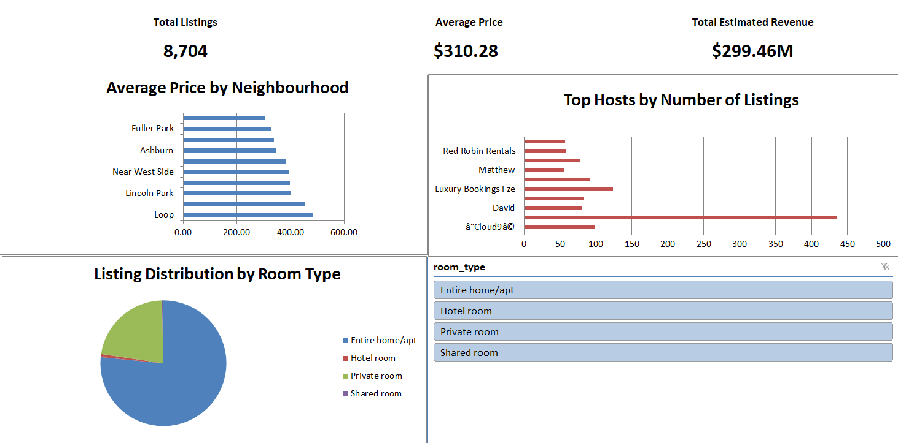

# Chicago Airbnb Market Analysis (Excel)

 

An interactive Excel dashboard analyzing 8,704 active Chicago Airbnb listings — linked PivotCharts, a slicer, and a What-If price sensitivity model built with a Data Table.

## Dashboard

Three PivotCharts on the `Dashboard` sheet, filtered by a shared `room_type` slicer:

| Chart | What it shows |
|---|---|
| Average price by neighbourhood | Loop leads at ~$482/night average; citywide average across all listings is ~$414/night |
| Top hosts by number of listings | Blueground is the single largest operator at 436 listings |
| Room type mix (pie) | Entire home/apt: 6,663 listings (76.5%) · Private room: 1,939 (22.3%) · Hotel room: 70 (0.8%) · Shared room: 32 (0.4%) |

**Headline numbers:** 8,704 total listings · $310.28 average price · $299.46M total estimated revenue.

## Key finding: a multi-account host network

Filtering the dashboard to Hotel room listings surfaces three different host names carrying "RoomPicks" branding in the top-hosts chart. Checking the raw data confirms this is a real pattern: **5 distinct host names across 6 host IDs, 150 listings total (1.7% of the dataset)**, all trading under the same brand:

| Host name | Listings | Host ID(s) |
|---|---|---|
| RoomPicks | 57 | 2 |
| RoomPicks Accommodations | 46 | 1 |
| Chicago Cozy Escapes By RoomPicks | 31 | 1 |
| RoomPicks By Antony | 11 | 1 |
| Roompicks By Victoria | 5 | 1 |

149 of the 150 listings are Private room or Hotel room stays — almost none are Entire home/apt. This is very likely one property management company operating under several separate host accounts. It's easy to miss in the unfiltered dashboard, since most of these sub-brands sit just below the top-10-hosts cutoff once all 8,704 listings are in view — it only surfaces once the slicer narrows things down to the much smaller Hotel room segment.

## Licensing lines up with stay length

`Compliance Status` and `Stay Type` correspond 1:1 across every listing in the dataset: all 5,766 Licensed listings are flagged Short-term, and all 2,938 Unlicensed listings are flagged Long-term. This tracks with how Chicago's shared housing ordinance actually works — a listing only needs a registration/license if guest stays run 31 nights or fewer; longer stays are exempt entirely.

## What-If analysis: price sensitivity

**Question:** if average price rose 5%, 10%, 15%, or 20%, how would total estimated revenue change?

**Method:** a one-variable Data Table on the `What-If Analysis` sheet. `A2` holds the price-increase input; `B2` computes `=SUM(listings!U:U)*(1+A2)`; the Data Table (column input cell = `A2`) recalculates that formula across five scenarios.

| Price increase | Total estimated revenue |
|---|---|
| 0% | $299,455,415 |
| 5% | $314,428,186 |
| 10% | $329,400,957 |
| 15% | $344,373,727 |
| 20% | $359,346,498 |

**Assumption:** this scales existing revenue by price alone — it assumes the same number of bookings still happens at a higher price. In reality, demand would likely soften as price rises, so these are upper-bound estimates, not forecasts.

## Known limitations

- **One host name has an uncorrected data quality issue.** 99 listings share a host name with a text-encoding artifact from the original import (a UTF-8/Latin-1 double-encoding mismatch) — it displays as garbled characters around "Cloud9" in the raw `listings` sheet and in the Top Hosts chart. It wasn't cleaned up in this version; a working fix (a helper-column formula, since Excel's Find & Replace fails on the hidden control character involved) is documented but not applied.
- One listing's `name` field originally contained a `#NAME?` error (likely because the source title started with `=`, which Excel read as a formula on import). It's been replaced with a plain placeholder value.
- The What-If model assumes constant demand at higher prices (see above) — treat the scenario table as an upper bound, not a forecast.
- The derived columns (`Estimated Bookings`, `Estimated Revenue`, `Price Tier`, `Compliance Status`, `Stay Type`) came pre-calculated in the source data; their exact formulas weren't independently re-derived here.
- The dataset is a single snapshot, not a time series — no seasonality or trend is captured.

## Files

- `Chicago_Airbnb_Analysis.xlsx` — `listings` (raw data), `Dashboard` (PivotCharts + slicer), `What-If Analysis` (scenario model), plus supporting pivot sheets (`Neighbourhood Analysis`, `Room Type Analysis`, `Room Type Comparison`, `Host Analysis`)
- `screenshots/dashboard.png` — dashboard screenshot, slicer set to show all room types

## Tools

Excel — PivotTables, PivotCharts, slicers, What-If Data Table analysis.

## Author

**Akshat Arya**
📫 [akshatarya81@gmail.com](mailto:akshatarya81@gmail.com)
🔗 [LinkedIn](https://www.linkedin.com/in/akshat-arya-a6644740b) · [GitHub](https://github.com/The-Akshat-Arya)
